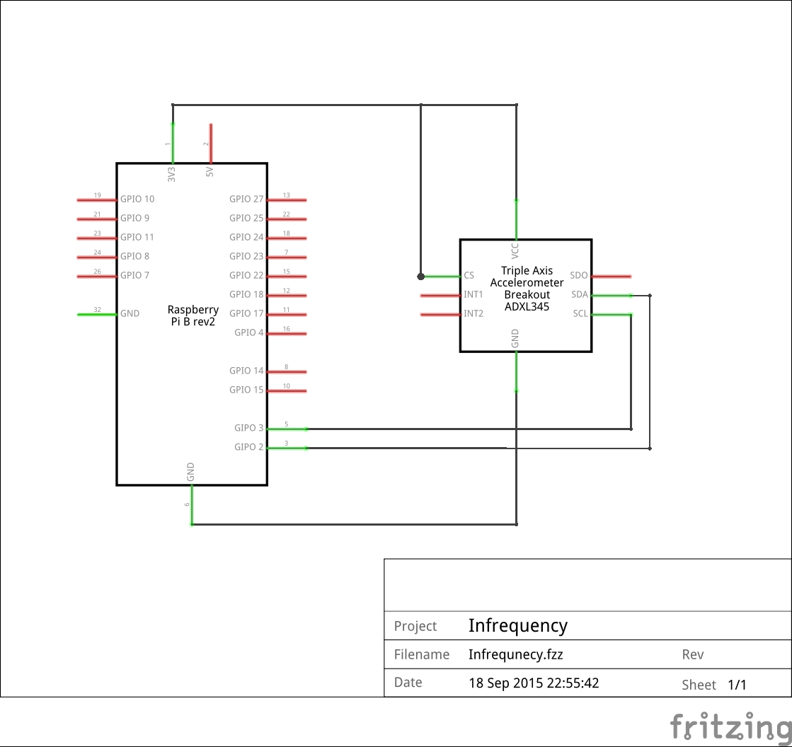

Infrequency
===

####Introduction
Is an internet of things radio.

####Components
1x Raspberry Pi

####Configuring the Pi


####Configuring the Pi for the ADXL345
I've borrowed heavily from [Martin O’Hanlon's guide](http://www.stuffaboutcode.com/2014/06/raspberry-pi-adxl345-accelerometer.html).

Add I2C modules
* ```` sudo nano /etc/modules ````
* ```` i2c-bcm2708 ````
* ```` i2c-dev ````

Remove I2C from the blacklist
* ```` sudo nano /etc/modprobe.d/raspi-blacklist.conf ````
* ```` #blacklist i2c-bcm2708 ````

Reboot

Get the i2c stuff
* ```` sudo apt-get install python-smbus i2c-tools git-core ````
* ```` sudo i2cdetect -y 1 ````

####Configuring the ADXL345
I came across a strange error with the breakout board and the i2ctools did not recognise the device. My solution was to connect the `cs` pin to the 3v3 output.



The wiring otherwise involves:
| ADXL345  | RPi |
|---|---|
| GND | GND (pin 9)|
| Vcc | 3v3 (pin 1)|
| SDA | SDA (pin 3)|
| SCL | SCL (pin 5)|
| CS  | 3v3 (pin 17)|
| INT1 | NC |
| INT2 | NC |
